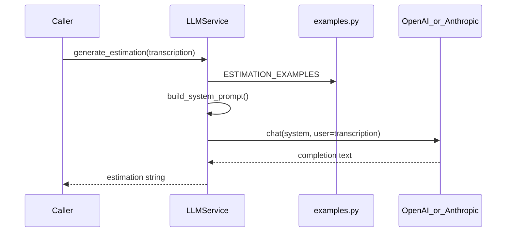

# LLM estimation service (CAG)

## Context

- [`estimador-cag/app/services/llm_service.py`](estimador-cag/app/services/llm_service.py) is empty; this is the only implementation target (no router changes).
- Examples live in [`estimador-cag/app/context/examples.py`](estimador-cag/app/context/examples.py) as `ESTIMATION_EXAMPLES` (list of `meeting_summary` + `estimation`).
- [`.env.example`](estimador-cag/.env.example) already defines `LLM_PROVIDER` and `LLM_MODEL`; [`config.py`](estimador-cag/app/config.py) must be extended to load them (defaults: `openai`, `gpt-4o-mini`).
- [`pyproject.toml`](estimador-cag/pyproject.toml) has no LLM SDKs or pytest yet.

## Architecture



## Public API (in `llm_service.py`)

| Function | Responsibility |
|----------|----------------|
| `build_system_prompt() -> str` | English system instructions: role as expert software estimator; use reference examples for format/depth; produce estimation for a new video-call transcription. Serialize every entry in `ESTIMATION_EXAMPLES` (numbered sections with **Meeting summary** and **Estimation**). |
| `async def generate_estimation(transcription: str) -> str` | Validate non-empty `transcription`; call provider with `system=build_system_prompt()` and user message wrapping the transcription (clear delimiter, English instruction to estimate). Return assistant text only. |

**Prompt language:** Code, comments, and system instructions in **English** ([base-standards](docs/base-standards.md)); example bodies may stay Spanish (reference data).

**Provider selection** (from `settings.llm_provider`):

- `openai`: `openai.AsyncOpenAI(api_key=settings.openai_api_key)`, `chat.completions.create(model=settings.llm_model, messages=[...])`
- `anthropic`: `anthropic.AsyncAnthropic(api_key=settings.anthropic_api_key)`, `messages.create(model=..., system=..., messages=[{"role":"user","content":...}])`

Raise a small domain-style exception (e.g. `LlmConfigurationError`) when API key is missing or provider is unsupported; raise `ValueError` for blank transcription.

Optional thin helper `_get_completion(system: str, user: str) -> str` to keep provider branching in one place (still in the same file; no full infrastructure layer for this scope).

## Config and dependencies

Update [`estimador-cag/app/config.py`](estimador-cag/app/config.py):

```python
llm_provider: str = "openai"
llm_model: str = "gpt-4o-mini"
```

Update [`estimador-cag/pyproject.toml`](estimador-cag/pyproject.toml):

- Runtime: `openai`, `anthropic`
- Dev: `pytest`, `pytest-asyncio`

Run `uv sync` after dependency changes.

## Tests (TDD)

Add [`estimador-cag/tests/test_llm_service.py`](estimador-cag/tests/test_llm_service.py):

1. **`build_system_prompt`**: Assert prompt contains role wording, each example’s `meeting_summary` snippet, and structure markers (e.g. "Example 1").
2. **`generate_estimation`**: `@pytest.mark.asyncio` with `unittest.mock.patch` on the async client’s `create` method; assert messages include built system prompt and user content with transcription; assert returned string matches mocked completion.
3. **Validation / config**: Empty transcription raises; missing API key raises `LlmConfigurationError` (or chosen type).

No live API calls in tests ([backend AI patterns](docs/backend-standards.md)).

## Verification

```bash
cd estimador-cag && uv run pytest tests/test_llm_service.py -v
```

Manual smoke (optional, with `.env` filled): short script or `uv run python -c "..."` calling `asyncio.run(generate_estimation(...))` — not committed.

## Out of scope (per your choice)

- POST `/estimations` in [`estimador-cag/app/routers/estimations.py`](estimador-cag/app/routers/estimations.py)
- Streaming, retries, or separate `app/infrastructure/ai/` abstraction (can be added later if the app grows)
