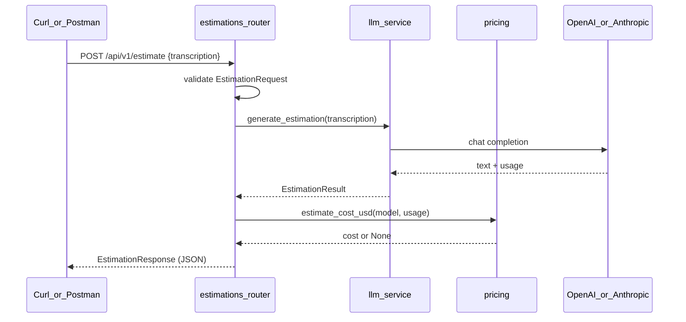

« # POST /api/v1/estimate endpoint

## Context

- [estimador-cag/app/routers/estimations.py](estimador-cag/app/routers/estimations.py) currently only declares `router = APIRouter(prefix="/estimations", tags=["estimations"])` with no routes. The prefix must become `/api/v1` so the path is exactly `/api/v1/estimate`.
- [estimador-cag/app/services/llm_service.py](estimador-cag/app/services/llm_service.py) exposes `async generate_estimation(transcription: str) -> str` plus `LlmConfigurationError`. It currently discards provider `usage`, so it must return a richer result for the tokens/cost fields.
- [docs/backend-standards.md](docs/backend-standards.md) requires Pydantic schemas in `app/schemas/`, explicit `response_model` on every route, no business logic in handlers, and validation at the boundary.
- `app/schemas/` does not exist yet; `httpx` is not a dependency yet (needed for FastAPI's `TestClient`/`ASGITransport`).

## Flow



## 1. Service returns usage (`llm_service.py`)

Replace the `str` return with a typed result so the router can report tokens without knowing provider details:

```python
@dataclass(frozen=True)
class EstimationResult:
    content: str
    provider: str
    model: str
    input_tokens: int | None
    output_tokens: int | None
```

- `_get_completion()` returns `EstimationResult`, reading `response.usage.prompt_tokens` / `completion_tokens` for OpenAI and `response.usage.input_tokens` / `output_tokens` for Anthropic, tolerating `None` usage (mocks and providers may omit it).
- `provider`/`model` come from the normalized `settings.llm_provider` and `settings.llm_model`.
- Update the existing assertions in [estimador-cag/tests/test_llm_service.py](estimador-cag/tests/test_llm_service.py) that compare `result == "..."` to `result.content == "..."`, and add coverage for the parsed token counts.

## 2. Pricing helper (`app/services/pricing.py`)

Small table of USD per 1M tokens keyed by model name (`gpt-4o-mini`, `gpt-4o`, `claude-3-5-sonnet-20240620`) and:

```python
def estimate_cost_usd(model: str, input_tokens: int | None, output_tokens: int | None) -> float | None
```

Returns `None` for unknown models or missing usage; rounds to 6 decimals. Keeping it separate avoids the router growing pricing logic.

## 3. Schemas (`app/schemas/estimations.py`)

```python
class EstimationRequest(BaseModel):
    transcription: str = Field(min_length=1)

    @field_validator("transcription")
    @classmethod
    def reject_blank(cls, value: str) -> str: ...  # strips, rejects whitespace-only


class TokenUsage(BaseModel):
    input_tokens: int | None
    output_tokens: int | None
    total_tokens: int | None


class EstimationResponse(BaseModel):
    estimation: str
    model: str
    provider: str
    usage: TokenUsage | None = None
    estimated_cost_usd: float | None = None
    generated_at: datetime
```

`extra` stays default (ignored) so unknown request fields do not break clients; `model_config` includes a `json_schema_extra` example matching the requested payload so Swagger/Postman show it. Add `app/schemas/__init__.py`.

Note: `model` as a field name shadows nothing problematic in Pydantic v2 (only `model_` prefixed names are protected), so no alias is needed.

## 4. Router (`app/routers/estimations.py`)

```python
router = APIRouter(prefix="/api/v1", tags=["estimations"])


@router.post("/estimate", response_model=EstimationResponse)
async def create_estimation(request: EstimationRequest) -> EstimationResponse:
```

- Calls `generate_estimation(request.transcription)`, builds `TokenUsage`, calls `estimate_cost_usd`, sets `generated_at=datetime.now(timezone.utc)`.
- Error mapping: `LlmConfigurationError` -> `HTTPException(503, "LLM provider is not configured correctly")`; provider/SDK failures -> `HTTPException(502, "LLM provider request failed")`. Blank/missing `transcription` is already a 422 from schema validation.

## 5. Tests (TDD, write first)

New [estimador-cag/tests/test_estimations_api.py](estimador-cag/tests/test_estimations_api.py) using `httpx.AsyncClient` + `ASGITransport` against `app.main.app`, patching `app.routers.estimations.generate_estimation` with an `AsyncMock` (same patch-based style as the existing service tests; no DI layer added for a single function):

- 200 happy path: body contains `estimation`, `model`, `provider`, `usage.total_tokens`, `estimated_cost_usd`, `generated_at`; asserts the transcription reached the service.
- 422 for missing, empty, and whitespace-only `transcription`.
- 503 when the service raises `LlmConfigurationError`.
- 502 when the service raises a generic `RuntimeError`.
- Response still valid when the service reports `input_tokens=None` (usage/cost null).

New `tests/test_pricing.py`: known model computes expected cost, unknown model returns `None`.

## 6. Dependencies and docs

- `uv add --dev httpx` (adds the dev dep and refreshes `uv.lock`).
- Update [estimador-cag/README.md](estimador-cag/README.md) with the endpoint, request/response shape, and a curl example:

```bash
curl -X POST http://localhost:8000/api/v1/estimate \
  -H "Content-Type: application/json" \
  -d '{"transcription": "En la reunion con el cliente se discutio..."}'
```

## Verification

```bash
cd estimador-cag && uv run pytest -v
cd estimador-cag && uv run uvicorn app.main:app --reload   # then the curl above with a real API key in .env
```
»