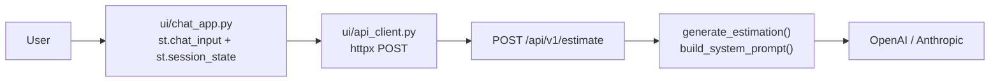

# Streamlit Chat UI for the CAG Estimator

## Approach

A new `ui/` package inside [estimador-cag](estimador-cag) (same uv project, same `.env`) that talks to the FastAPI service over HTTP with `httpx`. Because the call goes through the API, the system prompt is automatically the same one built by `build_system_prompt()` in [estimador-cag/app/services/llm_service.py](estimador-cag/app/services/llm_service.py), and the LLM API key never leaves the backend — the Streamlit process only needs a base URL.

## Files

- `estimador-cag/ui/config.py` — `UiSettings(BaseSettings)` mirroring the pattern in [estimador-cag/app/config.py](estimador-cag/app/config.py), reading the same `.env`:
  - `estimator_api_url: str = "http://localhost:8000"`
  - `estimator_request_timeout_seconds: float = 120.0`
- `estimador-cag/ui/api_client.py` — typed sync client:
  - `@dataclass(frozen=True) class Estimation` with `content`, `model`, `provider`, `estimated_cost_usd`, `total_tokens`
  - `class EstimatorApiError(Exception)`
  - `def request_estimation(transcription: str) -> Estimation` — `httpx.post(f"{base_url}/api/v1/estimate", json={"transcription": ...})`, maps 503/502/timeouts/connect errors to `EstimatorApiError` with readable messages
- `estimador-cag/ui/chat_app.py` — Streamlit entrypoint:
  - `st.session_state.messages: list[dict[str, str]]` initialized once; every rerun replays it through `st.chat_message(role)` + `st.markdown(content)`
  - `st.chat_input("Paste the meeting transcription...")` appends the user turn, calls `request_estimation` inside `st.spinner`, appends the assistant turn
  - assistant turns carry an optional caption line (`provider`, `model`, tokens, approx USD) built by a pure helper `build_usage_caption(estimation) -> str` so it is unit-testable
  - `EstimatorApiError` is rendered as an assistant message plus `st.error`, so history stays coherent
  - each submission is an independent estimation; prior turns are display-only

## Config and packaging

- `estimador-cag/pyproject.toml`: add `streamlit` to `dependencies`, and move `httpx` from `[dependency-groups].dev` to `dependencies` (now runtime, not just test-only).
- `estimador-cag/.env.example`: add `ESTIMATOR_API_URL=` and `ESTIMATOR_REQUEST_TIMEOUT_SECONDS=`. No API key is added for the UI.
- Run command: `uv run streamlit run ui/chat_app.py` (with `uv run uvicorn app.main:app --reload` in a second terminal).
- `pythonpath = ["."]` is already set in `[tool.pytest.ini_options]`, so `ui` imports resolve in tests.

## Tests (TDD, written before each implementation step)

- `estimador-cag/tests/test_ui_api_client.py` — mock `httpx.post` / use `httpx.MockTransport`: happy path maps the JSON response fields; 503 and 502 raise `EstimatorApiError`; `httpx.ConnectError` and `httpx.TimeoutException` raise `EstimatorApiError`; blank transcription rejected before the request.
- `estimador-cag/tests/test_ui_chat_app.py` — `streamlit.testing.v1.AppTest` with `ui.chat_app.request_estimation` patched: submitting input produces one user and one assistant message; a second submission keeps all four messages in order (history persistence); an `EstimatorApiError` renders an error without losing history. Plus a direct unit test of `build_usage_caption`.

## Docs

Update [estimador-cag/README.md](estimador-cag/README.md): new "Chat UI" section (setup, run command, the `ESTIMATOR_API_URL` variable, note that the API key stays in the backend `.env`) and add `ui/` to the project-structure tree.